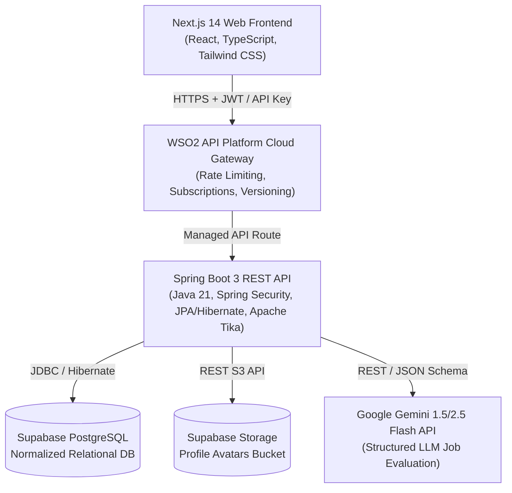
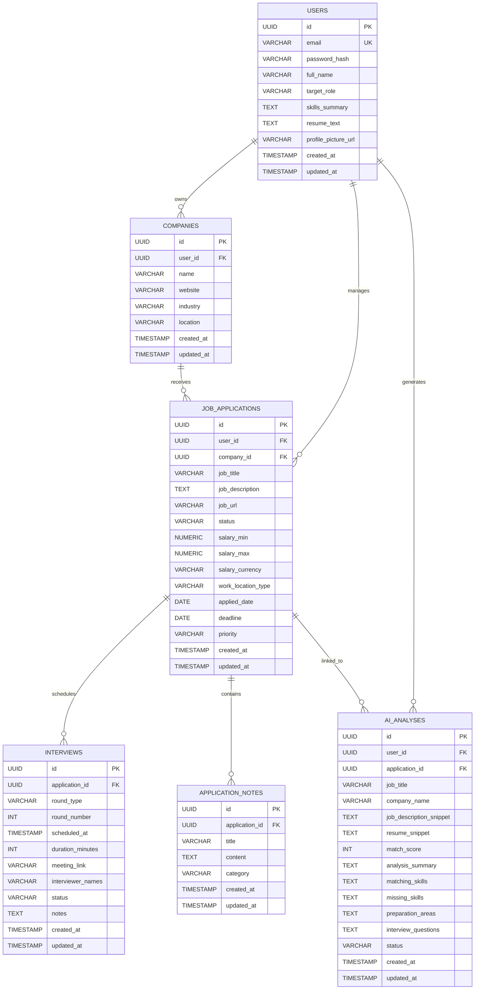
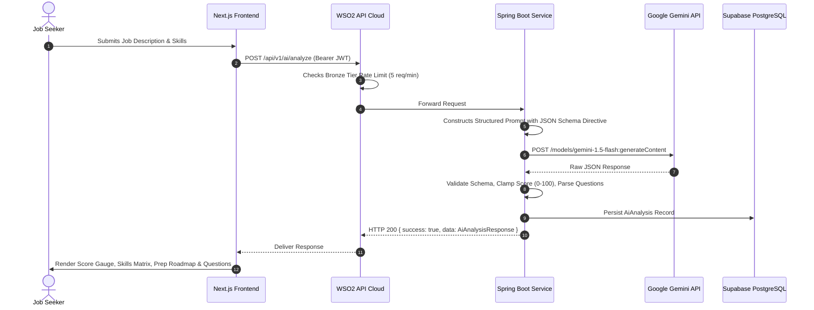

# AI Job Application Tracker — System Architecture & Design

This document details the system design, component responsibilities, database schema, security model, Gemini AI structured integration, and WSO2 API Platform Cloud architecture for the **AI Job Application Tracker**.

---

## 1. High-Level System Architecture

---

## 2. Component Design & Responsibilities

### Frontend Layer (Next.js 14 App Router)
- **State & Routing**: App Router with dynamic client components for real-time reactivity.
- **Kanban Board**: Drag-and-drop / single-click stage transitions with optimistic UI updates.
- **AI Studio**: Interactive form feeding job descriptions and candidate skills into Gemini AI, rendering visual match gauges and preparation roadmaps.
- **Interview Hub**: Chronological schedule cards with countdown timers, status changers, and direct Google Meet / Zoom launchers.
- **Profile & Resume Manager**: Avatar upload with magic-byte validation and automated CV parsing.

### API Gateway Layer (WSO2 API Platform Cloud)
- **API Publishing & Versioning**: Exposes `/job-tracker/v1` mapped to production Spring Boot upstream.
- **Throttling Policies**: Silver tier (60 req/min) for general CRUD, Bronze tier (5 req/min) for AI analysis to protect Gemini quota.
- **Security Pass-through**: Passes JWT Bearer tokens directly downstream while enforcing API subscription keys.
- **Traffic Observability**: Real-time latency tracking, invocation volume metrics, and error rates.

### Backend Layer (Spring Boot 3 + Java 21)
- **Layered Architecture**: Controller → Service → Repository. Thin controllers with `@Valid` DTO validation.
- **Security**: Spring Security with stateless `JwtAuthenticationFilter`, BCrypt hashing, and user-isolated multi-tenant data access.
- **Persistence**: Spring Data JPA with PostgreSQL, indexing on foreign keys and search columns, and custom JPQL metrics queries.
- **Supabase Storage Service**: Multi-layer security validation (magic byte header inspection, MIME whitelist, size clamping) for avatar asset storage.
- **Resume Parser Service**: Apache Tika document analysis extracting text from PDF, DOCX, and TXT resumes.
- **Gemini AI Service**: Resilient client enforcing strict JSON schema, match score validation, retry handling, and fallback capabilities.

---

## 3. Database Schema Design (PostgreSQL / Supabase)

---

## 4. Gemini AI Integration Pipeline

---

## 5. Security Architecture

1. **Password Protection**: BCrypt with strength factor 10.
2. **Stateless JWTs**: HMAC-SHA256 tokens carrying user identity, expiration timestamp, and subject UUID.
3. **Data Isolation**: Every repository query enforces `user_id = :userId` to guarantee zero cross-tenant leakage.
4. **Error Masking**: Internal server errors, database exceptions, and third-party stack traces are suppressed from the client and translated into sanitized `ErrorResponse` envelopes.
